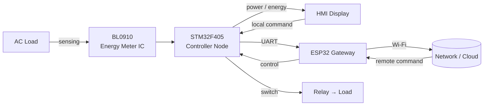

<div align="center">

# ⚡ Smart Electrical Energy Management System
### SEEMS

<p>
  <em>A distributed IoT platform for real-time monitoring, control, and optimization of electrical energy.</em>
</p>


<br><br>

[](https://opensource.org/licenses/MIT)


</div>

---

## 📌 Table of Contents

- [About the Project](#-about-the-project)
- [Key Features](#-key-features)
- [System Architecture](#-system-architecture)
- [Workflow](#-end-to-end-workflow)
- [Project Visuals](#-project-visuals)
- [Tech Stack](#-tech-stack)
- [Hardware Components](#-hardware-components)
- [Getting Started](#-getting-started)
- [Repository Structure](#-repository-structure)
- [Authors](#-authors)
- [License](#-license)

---

## 🌐 About the Project

The **Smart Electrical Energy Management System (SEEMS)** is a scalable, IoT-based solution that monitors, controls, and optimizes electrical energy consumption in real time. Built on a **distributed architecture** — STM32 controller nodes paired with an ESP32 gateway — the system is suitable for **residential, commercial, and industrial** deployments.

Developed as a **Final Year Thesis** for the **Bachelor of Technology in Electronics Engineering** at **Preah Kossomak Polytechnic Institute** (Class of 2024).

---

## ✨ Key Features

| | Feature | Description |
|---|---------|-------------|
| 📊 | **Real-Time Monitoring** | Live voltage, current, power, and energy readings |
| 🎛️ | **Local & Remote Control** | Switch loads via the HMI touchscreen or over Wi-Fi |
| 🧩 | **Distributed & Modular** | Add controller nodes without re-architecting the system |
| 🖥️ | **Intuitive HMI** | Touch dashboard built with SquareLine Studio |
| 🔌 | **Reliable Actuation** | Relay-based load switching with safe-state handling |
| ☁️ | **Cloud-Ready Gateway** | ESP32 aggregates data for remote access |

---

## 🧠 System Architecture

SEEMS follows a **gateway–node** topology. A central **ESP32 gateway** coordinates one or more **STM32F405 controller nodes**, each responsible for local sensing and actuation. This separation of concerns keeps the system responsive and easy to expand.

<div align="center">
  <a href="System Overview/Hardware System diagram.jpg" target="_blank">
    
  </a>
  <br>
  <em>Click to view full resolution.</em>
</div>

| Layer | Component | Responsibility |
|-------|-----------|----------------|
| **Edge** | STM32F405 Node | Measure V/I, compute power & energy, drive relays |
| **Gateway** | ESP32-WROOM-32U | Aggregate data, manage Wi-Fi/cloud, relay commands |
| **Interface** | HMI Display | Real-time feedback and local user control |

---

## 🔄 End-to-End Workflow



**Sequence**

1. **Measurement** — The BL0910 IC senses AC voltage and current.
2. **Processing** — The STM32F405 computes power and energy metrics.
3. **Display** — Results are pushed to the HMI in real time.
4. **Communication** — Data travels to the ESP32 over UART.
5. **Gateway** — The ESP32 handles Wi-Fi and aggregates system data.
6. **Actuation** — Relays switch loads based on local or remote input.

---

## 🖼️ Project Visuals

<table>
  <tr>
    <th align="center">Main Dashboard</th>
    <th align="center">Real-Time Graph</th>
  </tr>
  <tr>
    <td></td>
    <td></td>
  </tr>
</table>

---

## 🧰 Tech Stack

**Languages:** C · C++

| Target | Toolchain / Framework |
|--------|------------------------|
| ESP32 Gateway | PlatformIO + Arduino Framework |
| STM32 Node | STM32CubeIDE (HAL) |
| HMI | SquareLine Studio |

**Protocols:** UART (STM32 ↔ ESP32) · Wi-Fi (ESP32 ↔ Network)

---

## 🔩 Hardware Components

| Component | Description | Role |
|-----------|-------------|------|
| **ESP32-WROOM-32U** | Wi-Fi-enabled MCU | Data aggregation, cloud gateway |
| **STM32F405RG** | High-performance Cortex-M4 MCU | Sensing, processing, load control |
| **BL0910** | Energy metering IC | AC voltage/current sensing |
| **HMI Display** | SquareLine Studio UI | User interface |
| **12V Songle Relays** | Electromechanical switch | Load on/off control |

---

## 🚀 Getting Started

### Prerequisites

- [STM32CubeIDE](https://www.st.com/en/development-tools/stm32cubeide.html)
- [PlatformIO for VS Code](https://platformio.org/)
- Hardware components listed above

### Hardware Setup

1. Assemble components per the schematics in `Hardware/`.
2. Verify connections between the STM32, ESP32, BL0910 sensors, and HMI.

### Firmware Upload

| Target | Steps |
|--------|-------|
| **STM32 Node** | Open `Firmware/STM32_F405_Controller Node/` in STM32CubeIDE → build → flash |
| **ESP32 Gateway** | Open `Firmware/ESP32_Gateway_SEEMs/` in PlatformIO → set Wi-Fi credentials → upload |
| **HMI** | Open `Firmware/HMI Screen display/` in SquareLine Studio → export → load `.tft` via SD card |

### Run

1. Power on all devices.
2. The HMI loads the dashboard.
3. The ESP32 connects to Wi-Fi and links with the STM32.
4. The system is live for real-time monitoring and control.

---

## 📁 Repository Structure

```
📦 SEEMS
├── 📂 Firmware/
│   ├── 📂 ESP32_Gateway_SEEMs/
│   ├── 📂 STM32_F405_Controller Node/
│   └── 📂 HMI Screen display/
├── 📂 Hardware/
├── 📂 System Overview/
├── 📂 Thesis Report and presentation/
└── 📄 README.md
```

---

## 👥 Authors

| Name | Role |
|------|------|
| **Brorn Munyratanak** | Co-developer |
| **Noch Kakada** | Co-developer |

Final Year Thesis · **Electronics Engineering** · **Preah Kossomak Polytechnic Institute** (Class of 2024)

> Special thanks to our advisors and faculty for their guidance throughout the project.

---

## 📜 License

Licensed under the [MIT License](https://opensource.org/licenses/MIT).

<div align="center">
  <sub>Built with ⚡ for a smarter, more efficient energy future.</sub>
</div>
